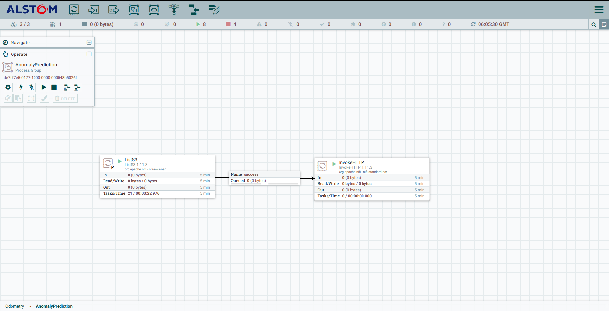

Odometry Classification
==============================

Building a training pipeline having preprocessing, training and deployment of corresponding prediction services


## Installation and implementation

- Need python>=3.6 and python3-venv, create a new environment first

If python3-env library is not installed, install using below line, after that create environment
```
sudo apt install python3-venv
```

```
python3 -m venv mdp_env
source mdp_env/bin/activate
```

- Git clone (need credentials)
```
git clone https://alstom-smart-mobility@dev.azure.com/alstom-smart-mobility/Odometry/_git/odometry_classification -b development
```

- Install requirements
```
cd odometry_classification
pip install -U setuptools wheel pip
pip install -e .
<!-- pip install -r requirements.txt -->
```

## Before training

- First set mlflow environment varibles and you can change parameter in `train_config.json` present in directory `odometry_classification`
```
export MLFLOW_S3_ENDPOINT_URL='https://raw-data-storage.mobility-odometry.smart-mobility.alstom.com'
export AWS_ACCESS_KEY_ID='mobilityodometry'
export AWS_SECRET_ACCESS_KEY='<>'

export MLFLOW_TRACKING_USERNAME='mlflow'
export MLFLOW_TRACKING_PASSWORD='<>'
```

- Second if you would like to use different instance of minio, There are many changes could be required. ( Suggestion use existing minio instance )

- Third, to do model deployment need to install `faas-cli` and do login. Installation for ubuntu
```
curl -sSL https://cli.openfaas.com | sudo -E sh
faas-cli login -u openfaasgw -p tahj:i4jae3Reemo -g https://openfaasgw.mobility-odometry.smart-mobility.alstom.com
```

## Training

**NOTE: First go through Before training step**

- To run anomaly detection (you should be in directory `odometry_classification`). There are few models for anomaly detection, which we can choose in `train_config.json`. Default is `IsolationForest` model, availabel models are
    - IsolationForest
    - EllipticEnvelope
    - OneClassSVM
```
from odometry import runAnomalyTraining
runAnomalyTraining(features_dir='features/4024', file_path=None)
```


- To run odometry classification, there are two ways
    - one through config and python file
    - another using `odometry` library

We will go with the `odometry` library, Provide two arguments:
   - `file_path` (it could be a csv tagged file or a directory of tagged file)
   - `vehicle_id` (it could be one number or a list of number)
   - `epochs` (training epochs)
   - `num_workers` (number of workers to proceed with multiple training, by default it takes all the cpus and leaves two behind)

```
from odometry import runOdometryTraining
runOdometryTraining(file_path='examples/feedback.csv', vehicle_id='4005')
```

*Also when you run training locally, you will face a nifi connection error. Aviod it.*


To use minio client from `odomtery` library
```
from odometry import create_minio_client

bucket_name = 'odometryclassification'
bucket_path = 'examples/feedback.csv'
df = <>
mc = create_minio_client(endpoint=<>, access_key=<>, secret_key=<>)
mc.write_df_to_minio(df, bucket_name, bucket_path)
```

To read metrics json
```
bucket_name = 'odometryclassification'
bucket_path = 'examples/6067.json'
mc.get_dict(bucket_name, bucket_path)
```

To create bucket
```
bucket_name='mlflow'
mc.create_bucket_if_not_exist(bucket_name)
```

## How to Deploy openfaas functions

Need a kubernetes cluster where `kubernetes` and `faas-cli` should be installed
Before deployment of openfaas functions, need to create few secrets first in kubernetes, to create it
```
cd odometry_classification/odometry/openfaas/secrets
kubernetes apply -f minio.yaml
kubermetes apply -f mlflow.yaml
kubermetes apply -f postgres.yaml
```

After this we need a openfaas template to create a openfaas function, So there is `template` directory in openfaas folder, copy the folder in any function before deployment of function.
For e.g. anomaly prediciton
```
cd odometry_classification/odometry/openfaas
cp -r template anomaly-prediction
```

Before moving further Note one thing, if you change any function, so before running deployment command change `skip_build` value to `False`.


*First install and login in faas-cli* 
```
curl -sSL https://cli.openfaas.com | sh
faas-cli login -u openfaasgw -p tahj:i4jae3Reemo -g https://openfaasgw.mobility-odometry.smart-mobility.alstom.com
```

- to deploy data-creation (create single csv file using all the zip file of train data) 
```
cd odometry_classification/odometry/openfaas/data-extraction
faas-cli up -f data-extraction.yml
```

- to deploy event-creation (create pkl files using csv file generated in previous step) 
```
cd odometry_classification/odometry/openfaas/event-creation
faas-cli up -f event-creation.yml
```

- to deploy create-feature (create features using all pkl files) 
```
cd odometry_classification/odometry/openfaas/create-feature
faas-cli up -f create-feature.yml
```

- to deploy anomaly-prediction (gnerate anomaly predictions using features data) 
```
cd odometry_classification/odometry/openfaas/anomaly-prediction
faas-cli up -f anomaly-prediction.yml
```


## Nifi odometry workflow

For now, 4 process group has been created for each process


How one process looks like is here, for example anomaly prediction
 - ListS3
 - InvokeHTTP




## To get metrics artifact from mlflow for a train

```
from odometry import MlflowClient

tracking_uri = 'http://mlflow.mobility-odometry.smart-mobility.alstom.com'
mc = MlflowClient(tracking_uri)
pf = mc.get_perf_metrics(4005)
```

Output would be a nested dictionary, you can see dummy copy in `templates/perf.json` present in directory `odometry_classification`


## To deploy any model or existing openfaas function using odometry library

Let us see an example of deploying new model for clasisfication predicition, here model_path and label_mapping_path are dummy values. If you get value for exit_code 0, it's deployed successfully.

```
from odometry import FunctionDeployment

fp = FunctionDeployment(name='odometry-prediction', gateway='https://openfaasgw.mobility-odometry.smart-mobility.alstom.com')
fp.build_yamls(model_path='s3://mlflow/4/fc5368c673554c9bb5b9d2ee41feb64f/artifacts/4005', label_mapping_path='s3//mlflow/4/fc5368c673554c9bb5b9d2ee41feb64f/artifacts/label_mapping.json')
exit_code = fp.deploy()
```

Project Structure
------------

    ├── LICENSE
    ├── Makefile           <- Makefile with commands like `make data` or `make train`
    ├── README.md          <- The top-level README for developers using this project.
    ├── data
    │
    ├── docs               <- A default Sphinx project; see sphinx-doc.org for details
    │
    ├── models             <- Trained and serialized models, model predictions, or model summaries
    │
    ├── notebooks          <- Jupyter notebooks. Naming convention is a number (for ordering),
    │
    ├── openfaas            <- Deployment of faas functions
    │   ├── secrets        
    │   │   ├── minio.yaml        
    │   │   ├── mlflow.yaml      
    │   │   └── postgres.yaml            
    │   │ 
    │   ├── data-extraction          
    │   │   ├── data-extraction         
    │   │   └── data-extraction.yml                 
    │   │
    │   ├── event-creation          
    │   │   ├── event-creation         
    │   │   └── event-creation.yml                 
    │   │
    │   ├── create-feature          
    │   │   ├── create-feature         
    │   │   └── create-feature.yml                 
    │   │
    │   ├── anomaly-prediction          
    │   │   ├── anomaly-prediction         
    │   │   └── anomaly-prediction.yml                 
    │
    ├── requirements.txt   <- The requirements file for reproducing the analysis environment, e.g.
    │                         generated with `pip freeze > requirements.txt`
    │
    ├── setup.py           <- makes project pip installable (pip install -e .) so odometry can be imported
    ├── odometry                <- Source code for use in this project.
    │   ├── __init__.py    <- Makes odometry a Python module
    │   │
    │   ├── client           <- Minio client
    │   │   └── client.py
    │   │    
    │   ├── config           <- pipeline configurations
    │   │   └── config.py
    │   │        
    │   ├── data           <- Scripts togenerate data
    │   │   ├── data-extraction.py
    │   │   └── event-creation.py   
    │   │
    │   ├── features       <- Scripts to turn raw data into features for modeling
    │   │   └── build_features.py
    │   │
    │   ├── models         <- Scripts to train models and then use trained models
    │   │   │                 
    │   │   ├── models.py
    │   │   ├── model_preprocessing.py
    │   │   ├── metrics.py
    │   │   └── mlflow_callback.py    
    │   │
    │   ├── utils         <- Utility Scripts 
    │   │   │                 
    │   │   ├── client.py
    │   │   ├── default_logger.py
    │   │   ├── io.py
    │   │   └── log_artifacts.py   
    │   │ 
    │   └── visualization  <- Scripts to create exploratory and results oriented visualizations
    │       └── visualize.py
    │
    └── tox.ini            <- tox file with settings for running tox; see tox.readthedocs.io


## Setup over new platform

It requires so many steps along with the manual interventions

- Few secrets (minio secret, postgres sql secret, mlflow secret) need to be deployed manually
```
kubectl create secret generic minio-secret --from-literal=MINIO_ACCESS_KEY=<> --from-literal=MINIO_SECRET_KEY=<> --from-literal=MINIO_ENDPOINT=<> 
kubectl create secret generic mlflow-secret --from-literal=MLFLOW_TRACKING_USERNAME=<> --from-literal=MLFLOW_TRACKING_PASSWORD=<>
kubectl create secret generic postgres-secret --from-literal=POSTGRE_HOST=<> --from-literal=POSTGRE_DATABASE=<> --from-literal=POSTGRE_USER=<> --from-literal=POSTGRE_PASSWORD=<>
```

- 3 openfaas functions have to be deployed manually 
    - data-extraction
    - event-creation
    - create-feature
- 3 nifi process group has to be created manually
    - Data Extraction
    - Event Creation
    - Create Feature

    Each nifi process group should have two processors: **ListS3** and **InvokeHTTP**. It would require few credentials (minio).

- Need one bucket with the name `mlflow` in minio 
    (create bucket using UI or mc cli command)
    ```
    mc.create_bucket_if_not_exist('mlflow')
    ```

InvokeHTTP processor properties


ListS3 processor properties
